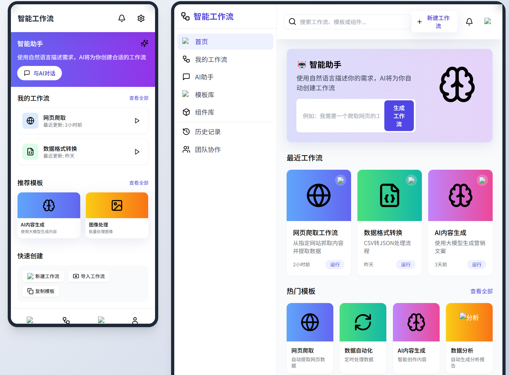
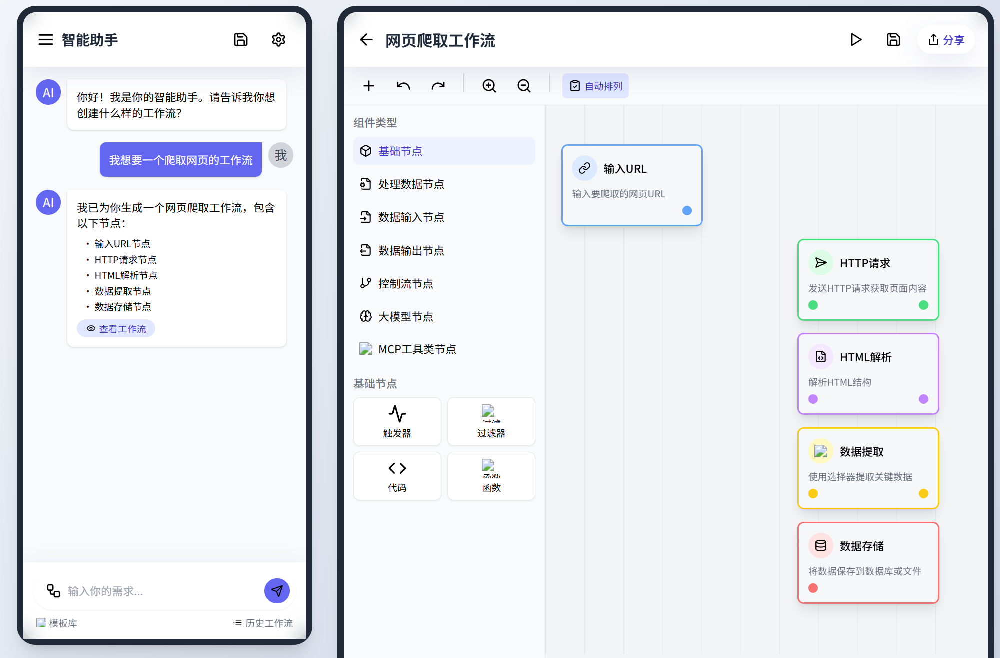
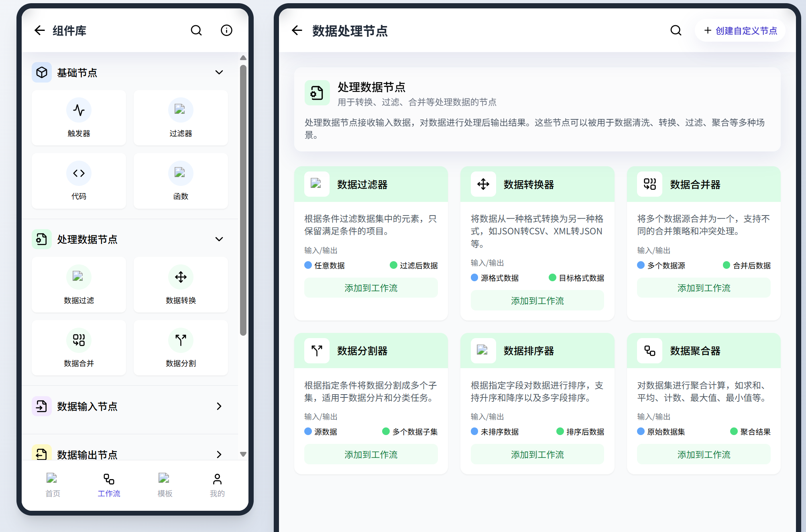
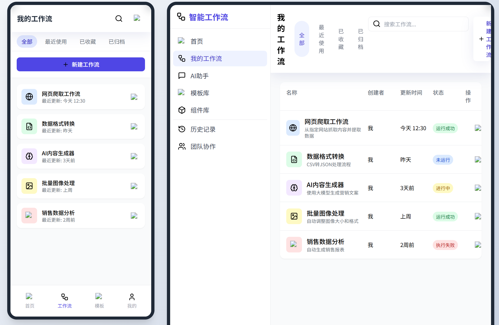
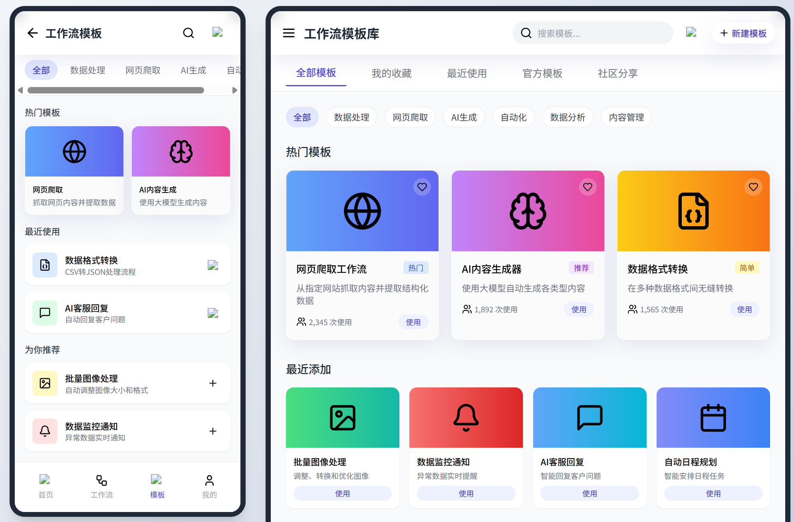

# Ruos-AI 

一个可视化智能工作流编排应用，基于大模型的智能体工作流自动编排，一句话即可自动编排生成工作流。

## 功能特点

- 基于Vue 3和TypeScript的前端架构
- 使用Tailwind CSS实现美观的UI设计
- 基于Vue Flow实现拖拽式工作流编辑Workflow Editor
- 支持节点连接、编辑和自动布局
- 实时工作流预览和执行

## 技术栈 

- **前端框架**：Vue 3、TypeScript
- **UI设计**：Tailwind CSS
- **工作流引擎**：Vue Flow
- **状态管理**：Pinia
- **构建工具**：Vite
- **桌面应用**：Electron
- **响应式设计**：支持手机端、平板端、PC端和Web端
- **自然语言处理**：基于大模型的工作流自动编排

## 安装依赖

使用pnpm安装依赖：

```bash
pnpm install
```

## 开发服务器

启动开发服务器：

```bash
pnpm dev
```

## 构建生产版本

构建生产版本：

```bash
pnpm build
```

## 项目结构

```
ruos-ai/
├── src/                     # 源代码目录
│   ├── assets/              # 静态资源
│   ├── components/          # 组件
│   │   └── workflow/        # 工作流编辑器组件
│   │       ├── BaseNode.vue # 基础节点组件
│   │       ├── WorkflowCanvas.vue # 工作流画布
│   │       └── ChatInterface.vue  # 聊天界面组件
│   ├── router/              # Vue Router配置
│   ├── store/               # Pinia状态管理
│   │   └── modules/         # 状态模块
│   │       └── workflow.ts  # 工作流状态管理
│   ├── types/               # 类型定义
│   ├── utils/               # 工具函数
│   ├── views/               # 页面视图
│   │   ├── WorkflowListView.vue     # 工作流列表页面
│   │   ├── WorkflowEditorView.vue   # 工作流编辑器页面
│   │   ├── WorkflowTemplatesView.vue # 工作流模板页面
│   │   ├── WorkflowComponentsView.vue # 组件库页面
│   │   └── ChatWorkflowView.vue     # 聊天工作流页面
│   ├── App.vue              # 应用根组件
│   ├── main.ts              # 应用入口
│   ├── style.css            # 全局样式
│   └── vite-env.d.ts        # Vite类型声明
├── artifacts/               # 设计图和资源
├── public/                  # 公共资源
├── .vscode/                 # VSCode配置
├── index.html               # HTML模板
├── package.json             # 项目依赖
├── postcss.config.js        # PostCSS配置
├── tailwind.config.js       # Tailwind CSS配置
├── tsconfig.json            # TypeScript配置
└── vite.config.ts           # Vite配置
```

### 核心模块说明

- **工作流画布** (`WorkflowCanvas.vue`): 实现节点拖拽、连线和编辑功能
- **基础节点** (`BaseNode.vue`): 定义节点的基本外观和交互行为
- **工作流状态管理** (`workflow.ts`): 管理工作流数据和操作
- **页面视图**: 提供工作流列表、编辑器、模板库等功能页面
- **聊天界面** (`ChatInterface.vue`): 通过自然语言创建工作流的界面

## 待完成任务

- ✅ 修复Vue Flow导入问题 
- ✅ 解决TypeScript类型错误
- 🔄 实现基于自然语言的工作流自动编排功能
- 🔄 实现工作流节点竖向排列布局
- 🔄 完成工作流节点分类（基础节点、处理数据节点、数据输入节点、数据输出节点、控制流节点、大模型节点、MCP工具类节点）
- 🔄 实现工作流执行时的动态流转效果
- 🔄 在聊天界面中集成工作流执行和结果展示
- 🔄 完善多端适配（移动端、平板端、PC端和Web端）
- 🔄 实现Electron桌面应用打包
- 实现节点连接逻辑
- 实现节点自定义配置面板
- 添加工作流执行历史记录功能
- 实现工作流节点输入/输出参数配置
- 添加保存/加载工作流功能
- 优化拖拽体验和UI细节

## 设计图

### 工作流列表页面


### 工作流编辑器


### 节点组件库


### 工作流模板页面


### 聊天工作流页面



## 联系方式

| 微信公众号 | 微信号 |
| :-: | :-: |
|  |  |

## 应用打包

### Windows/macOS/Linux 桌面应用（Electron）

1. 编译前端应用
```bash
npm run build
```

2. 构建Windows桌面应用
```bash
npm run build:win
```

3. 构建macOS桌面应用
```bash
npm run build:mac
```

4. 构建Linux桌面应用
```bash
npm run build:linux
```

构建好的安装包将位于`dist_electron`目录下。

### Android应用打包

Android应用打包需要先安装Android Studio和Android SDK。

1. 初始化Capacitor Android项目
```bash
npx cap add android
```

2. 同步Web代码到Android项目
```bash
npm run build
npx cap sync android
```

3. 打开Android Studio编辑Android项目
```bash
npx cap open android
```

4. 在Android Studio中编译APK
   - 选择菜单 Build > Build Bundle(s) / APK(s) > Build APK(s)
   - 或使用命令行：`cd android && ./gradlew assembleDebug`

构建好的APK将位于`android/app/build/outputs/apk/debug/`目录下。


